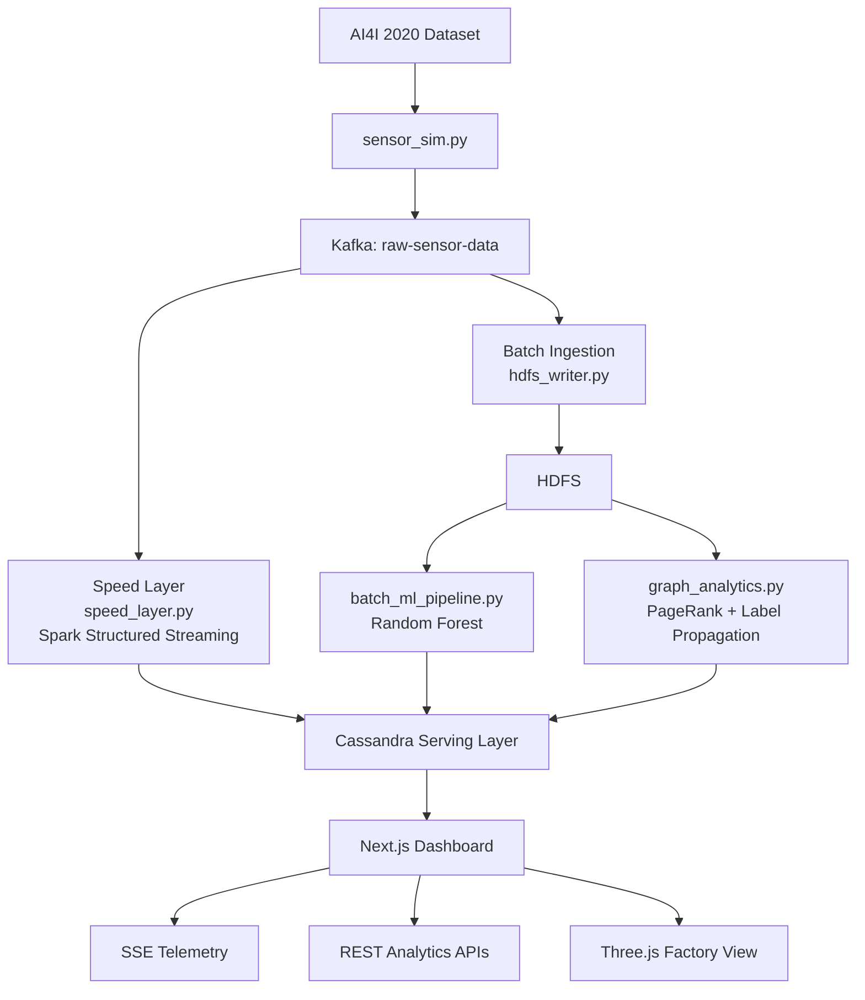
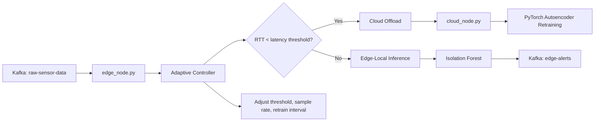
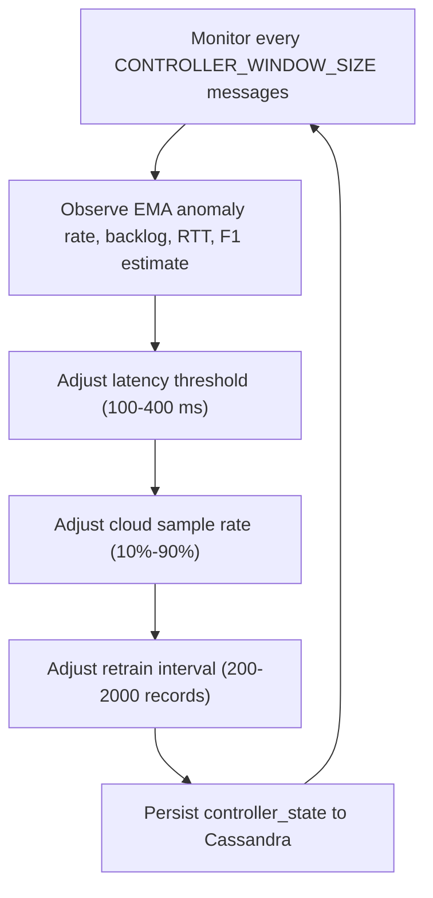

<div align="center">

# 🏭 Real-Time Predictive Maintenance System

### A Lambda Architecture Platform for Streaming Analytics, Graph-Based Failure Cascade Detection, and Edge-Cloud Fog Computing

[](#prerequisites)
[](#speed-layer)
[](#message-broker)
[](#serving-layer)
[](#dashboard)
[](#docker-infrastructure)

</div>

---

## Table of Contents

- [Overview](#overview)
- [Key Features](#key-features)
- [Architecture](#architecture)
  - [Lambda Architecture](#lambda-architecture)
  - [Edge-Cloud Fog Computing Layer](#edge-cloud-fog-computing-layer)
  - [Closed-Loop Adaptive Controller](#closed-loop-adaptive-controller)
  - [Graph-Augmented Anomaly Scoring](#graph-augmented-anomaly-scoring)
- [System Components](#system-components)
  - [Sensor Simulator](#1-sensor-simulator)
  - [Edge Node](#2-edge-node)
  - [Cloud Node](#3-cloud-node)
  - [Speed Layer](#4-speed-layer)
  - [HDFS Writer](#5-hdfs-writer)
  - [Batch ML Pipeline](#6-batch-ml-pipeline)
  - [Graph Analytics](#7-graph-analytics)
  - [Dashboard](#8-dashboard)
- [Data Schema](#data-schema)
  - [Kafka Topics](#kafka-topics)
  - [Cassandra Tables](#cassandra-tables)
- [Technology Stack](#technology-stack)
- [Getting Started](#getting-started)
  - [Prerequisites](#prerequisites)
  - [Installation](#installation)
  - [Quick Start (One Command)](#quick-start-one-command)
  - [Manual Execution](#manual-execution)
- [Startup Script Reference](#startup-script-reference)
- [Cleanup & File Management](#cleanup--file-management)
- [Teardown](#teardown)
- [Troubleshooting](#troubleshooting)
- [Project Structure](#project-structure)
- [Algorithms & Mathematical Formulations](#algorithms--mathematical-formulations)
- [Dataset](#dataset)
- [Performance Metrics](#performance-metrics)
- [Novel Technical Contributions](#novel-technical-contributions)
- [API Reference](#api-reference)

---

## Overview

This project implements a **production-grade, real-time predictive maintenance platform** built on the Lambda Architecture pattern. It simulates a factory floor of **5,000 industrial machines**, continuously generating sensor telemetry, detecting anomalies in real-time, identifying structural bottleneck machines through graph centrality analysis, and discovering failure cascade communities — all visualized through a live dashboard with 2D analytics panels and a 3D factory floor.

The system demonstrates how modern big data technologies (Apache Kafka, Spark, Cassandra, HDFS) can be orchestrated into a unified pipeline that serves both **real-time** (millisecond-latency anomaly detection) and **batch** (network-level failure pattern analysis) use cases simultaneously.

### What Makes This System Unique

Unlike traditional predictive maintenance systems that treat machines as independent entities, this platform models the **interconnection topology** between machines. Each sensor reading carries graph edge metadata, enabling the system to:

1. **Detect individual anomalies** in real-time (Speed Layer)
2. **Identify structural bottleneck machines** whose failure would cascade to others (PageRank)
3. **Discover failure cascade communities** — groups of densely interconnected machines at collective risk (Label Propagation)
4. **Self-optimize** its edge-cloud routing decisions through a closed-loop adaptive controller

---

## Key Features

| Feature | Description |
|---|---|
| 🔴 **Real-Time Anomaly Detection** | PySpark Structured Streaming with graph-augmented scoring |
| 🌐 **Graph-Based Failure Analysis** | PageRank bottleneck identification + Label Propagation community detection |
| 🌫️ **Edge-Cloud Fog Computing** | Latency-aware routing with dual ML models (Isolation Forest + Autoencoder) |
| 🔄 **Closed-Loop Adaptive Controller** | Self-optimizing thresholds, sample rates, and retraining intervals |
| 📊 **Live Dashboard** | SSE-powered real-time telemetry + REST batch analytics |
| 🏭 **3D Factory Visualization** | Three.js WebGL rendering of 5,000+ machines with health encoding |
| 🐳 **One-Click Deployment** | Single PowerShell script orchestrates Docker, Kafka, Spark, and Next.js |

---

## Architecture

### Lambda Architecture

The system implements the Lambda Architecture — a data processing pattern that provides both real-time and historical views of data through parallel speed and batch layers, unified through a serving layer.



### Edge-Cloud Fog Computing Layer

The edge-cloud layer simulates fog computing by dynamically routing sensor data between edge-local inference and cloud offloading based on real-time network latency:



### Closed-Loop Adaptive Controller

The `AdaptiveController` (in `edge_node.py`) replaces fixed thresholds with a **self-optimizing feedback loop**:



**Tuning parameters** (in `config.py`):
- `CONTROLLER_WINDOW_SIZE` = 200 — evaluate every 200 messages
- `CONTROLLER_ALPHA` = 0.3 — EMA smoothing for anomaly rate
- `CONTROLLER_BETA` = 0.2 — EMA smoothing for RTT

### Graph-Augmented Anomaly Scoring

The Speed Layer reads **community risk scores** and **PageRank centrality** from Cassandra (computed by Graph Analytics) and dynamically adjusts per-machine anomaly thresholds:

```
composite_score = (1 - α - β) × base_score
                + α × community_risk
                + β × machine_pagerank

Where:
  α = GRAPH_SCORE_ALPHA (0.4) — weight for community risk
  β = GRAPH_SCORE_BETA  (0.3) — weight for PageRank centrality
```

This creates a **feedback loop**: Graph analytics → Speed layer scoring → Edge routing decisions.

Machines in high-risk communities or with high PageRank (structural bottlenecks) get **lower anomaly thresholds**, making the system more sensitive to their degradation.

---

## System Components

### 1. Sensor Simulator
**File**: `sensor_sim.py`

| Attribute | Value |
|---|---|
| Input | `ai4i2020.csv` (UCI AI4I 2020 Predictive Maintenance Dataset) |
| Output | Kafka topic `raw-sensor-data` |
| Rate | ~100 messages/second |
| Machines | 5,000 simulated industrial machines |
| Features | 7 sensor fields + graph edge metadata |

**Sensor features per message:**

| Feature | Unit | Description |
|---|---|---|
| Air temperature | K | Ambient air temperature |
| Process temperature | K | Machine process temperature |
| Rotational speed | RPM | Spindle rotational speed |
| Torque | Nm | Applied torque |
| Tool wear | min | Cumulative tool usage time |
| Machine failure | 0/1 | Ground truth failure label |
| Product ID | String | Machine identifier (e.g., `L51308`) |

Each message is enriched with a `connected_to` field — an array of 1–3 other machine IDs representing the physical/logical connectivity graph. This transforms the flat sensor dataset into a **graph-structured telemetry stream**.

---

### 2. Edge Node
**File**: `edge_node.py`

Simulates fog/edge computing with latency-aware intelligent routing and a closed-loop adaptive controller.

**ML Model**: Isolation Forest (scikit-learn) — unsupervised anomaly detection on 5 sensor features.

**Routing algorithm:**
```
For each incoming sensor message:
  1. Measure simulated network RTT (50–500ms uniform random)
  2. IF latency < adaptive_threshold (starts at 200ms):
       → Route to CLOUD for centralized processing
       → Tag as "cloud_offload"
  3. ELSE (high latency / degraded network):
       → Process LOCALLY at edge using Isolation Forest
       → IF anomaly detected (prediction = -1):
           → Publish alert to Kafka "edge-alerts" topic
       → Data never leaves the edge
  4. Every CONTROLLER_WINDOW_SIZE messages:
       → Controller re-evaluates and adjusts thresholds
```

**Key metrics tracked:** total messages processed, anomalies detected at edge, cloud reduction ratio, controller optimization history.

---

### 3. Cloud Node
**File**: `cloud_node.py`

Centralized model retraining using accumulated historical data.

**ML Model**: PyTorch Autoencoder (encoder: 5→16→8→4, decoder: 4→8→16→5)
- Input: Normalized 5-feature sensor vectors
- Training: MSE reconstruction loss, Adam optimizer, 10 epochs
- Trigger: Automatic retraining every N records (adaptive, controlled by the controller)

---

### 4. Speed Layer
**File**: `speed_layer.py`

Real-time anomaly detection and machine state tracking using Apache Spark Structured Streaming.

**Pipeline:**
```
Kafka Source (raw-sensor-data)
  → JSON deserialization with schema enforcement
  → Graph-augmented anomaly scoring:
      - Load community_risk + pagerank_scores from Cassandra
      - Compute composite score with graph weights
      - Dynamic thresholds: machines in high-risk communities
        get lower thresholds for earlier detection
  → Fork into 2 sinks:
      Sink 1: realtime_alerts table (anomalous records only)
      Sink 2: machine_states table (all records, latest state per machine)
```

---

### 5. HDFS Writer
**File**: `hdfs_writer.py`

Batch data accumulation for the Batch Layer.

```
Kafka Consumer (raw-sensor-data)
  → Accumulate 500 records per batch
  → Write to local JSON file
  → docker cp to namenode container
  → hdfs dfs -put to HDFS (/user/hadoop/pdm_data/)
```

---

### 6. Batch ML Pipeline
**File**: `batch_ml_pipeline.py`

Periodic retraining of a supervised failure prediction model on accumulated HDFS data.

**ML Model**: Apache Spark MLlib Random Forest Classifier
- Features: Air temp, Process temp, Rotational speed, Torque, Tool wear
- Label: Machine failure (binary)
- Configuration: 50 trees, max depth 5
- Evaluation: F1 Score on 80/20 train/test split

---

### 7. Graph Analytics
**File**: `graph_analytics.py`

Network-level failure pattern discovery using graph algorithms on the machine interconnection topology.

**Algorithm 1 — PageRank (Bottleneck Detection):**
- Identifies the most "central" or "influential" machines in the factory network
- A machine with high PageRank is a structural bottleneck — its failure cascades to many others
- Config: `resetProbability=0.15`, `maxIter=10`
- Output: `pagerank_scores` table + `community_risk` aggregations

**Algorithm 2 — Label Propagation (Failure Cascade Community Detection):**
- Clusters machines into fault cascade communities — groups where a single failure propagates
- Config: `maxIter=5`
- Output: `failure_communities` table

**Data flow:**
```
hdfs_temp/*.json (snapshotted to graph_snapshot/)
  → Spark reads JSON records
  → Extract nodes: unique Product IDs
  → Extract edges: explode connected_to arrays
  → Construct GraphFrame(nodes, edges)
  → Run PageRank → Cassandra
  → Run Label Propagation → Cassandra
  → Compute community_risk aggregations → Cassandra
```

---

### 8. Dashboard
**Directory**: `frontend/`

A Next.js React application with two views:

#### Main Dashboard (`/`)

| Section | Data Source | Update Frequency |
|---|---|---|
| Adaptive Controller metrics | `/api/controller` (REST) | Polled every 10s |
| Stream Health (SSE latency) | `/api/stream` (SSE) | Real-time (~3s) |
| Real-Time Sensor Chart | `/api/stream` (SSE) | Real-time |
| Recent Anomalies | `/api/stream` (SSE) | Real-time |
| Machine Monitor (fleet stats) | `/api/states` (REST) | Polled every 10s |
| Bottleneck Nodes (PageRank) | `/api/pagerank` (REST) | Polled every 30s |
| Fault Cascade Clusters | `/api/communities` (REST) | Polled every 30s |

#### 3D Factory Floor (`/factory`)

- **Engine**: Three.js WebGL renderer
- **Scale**: Renders all 5,000+ machines as individual 3D cubes
- **Visual Encoding**:
  - Color: Green (healthy) / Red (critical)
  - Height: Proportional to torque (Nm)
  - Animation: Critical machines pulse
- **Interaction**: OrbitControls (drag to orbit, scroll to zoom), hover tooltips
- **Data Refresh**: Fetches from `/api/states` every 5 seconds

---

## Data Schema

### Kafka Topics

| Topic | Producer | Consumer | Description |
|---|---|---|---|
| `raw-sensor-data` | `sensor_sim.py` | Speed Layer, HDFS Writer, Edge Node | All raw telemetry |
| `edge-alerts` | `edge_node.py` | (Dashboard, optional) | Edge-detected anomalies |
| `cloud-data` | `edge_node.py` | `cloud_node.py` | Cloud-offloaded data |
| `controller-metrics` | `edge_node.py` | (Monitoring) | Adaptive controller state |

### Cassandra Tables

All tables live in the `pdm` keyspace:

```sql
-- Real-time anomaly alerts (Speed Layer output)
CREATE TABLE realtime_alerts (
    machine_id text,
    alert_time timestamp,
    latency_ms int,
    air_temp double, process_temp double,
    rotational_speed double, torque double,
    tool_wear int, prediction_score double,
    PRIMARY KEY (machine_id, alert_time)
) WITH CLUSTERING ORDER BY (alert_time DESC);

-- Current machine state snapshot (Serving Layer)
CREATE TABLE machine_states (
    machine_id text PRIMARY KEY,
    last_update timestamp,
    status text,       -- 'HEALTHY' or 'CRITICAL'
    air_temp double,
    torque double
);

-- PageRank centrality scores (Batch Layer - Graph Analytics)
CREATE TABLE pagerank_scores (
    machine_id text PRIMARY KEY,
    pagerank double,
    last_computed timestamp
);

-- Failure cascade communities (Batch Layer - Graph Analytics)
CREATE TABLE failure_communities (
    community_id text,
    machine_id text,
    PRIMARY KEY (community_id, machine_id)
);

-- Adaptive Edge-Cloud Controller state
CREATE TABLE controller_state (
    controller_id text PRIMARY KEY,
    latency_threshold double,
    cloud_sample_rate double,
    retrain_interval int,
    edge_anomaly_rate double,
    cloud_backlog int,
    avg_rtt double,
    last_updated timestamp
);

-- Per-community aggregated risk (Graph-Augmented Scoring)
CREATE TABLE community_risk (
    community_id text PRIMARY KEY,
    risk_score double,
    member_count int,
    critical_count int,
    avg_pagerank double,
    last_computed timestamp
);
```

---

## Technology Stack

| Layer | Technology | Purpose |
|---|---|---|
| Message Broker | Apache Kafka 7.4 + Zookeeper | Real-time event streaming |
| Stream Processing | Apache Spark 3.5.3 Structured Streaming | Speed layer micro-batch processing |
| Batch Processing | Apache Spark MLlib + GraphFrames | RF training + Graph analytics |
| Distributed Storage | Apache HDFS 3.2.1 (namenode + datanode) | Historical data lake |
| Serving Database | Apache Cassandra (latest) | Low-latency serving layer |
| Edge ML | scikit-learn (Isolation Forest) | Edge-local anomaly detection |
| Cloud ML | PyTorch (Autoencoder) | Centralized model retraining |
| Frontend | Next.js 16 + React + TypeScript | Dashboard and API server |
| 3D Visualization | Three.js | Interactive factory floor |
| Container Orchestration | Docker Compose | Kafka, Cassandra, HDFS |
| Runtime | Python 3.10+ / Node.js 18+ | Core runtime environments |

---

## Getting Started

### Prerequisites

| Requirement | Version | Required? | Notes |
|---|---|---|---|
| **Docker Desktop** | Latest | ✅ Yes | Must be **running** before starting |
| **Python** | 3.10+ | ✅ Yes | On system PATH |
| **Node.js** | 18+ | ✅ Yes | On system PATH |
| **Java 17** | 17.x | Bundled | Included in `jdk-17.0.18+8/` |
| **winutils.exe** | — | Bundled | Included in `hadoop/bin/` |
| **Free RAM** | ~6 GB | ✅ Yes | For Docker + Spark + Kafka |
| **Free ports** | 9092, 9042, 9000, 9870, 3000 | ✅ Yes | Used by services |

### Installation

**1. Clone the repository:**
```bash
git clone https://github.com/burntcookiedough/Real-Time-Predictive-Maintenance.git
cd Real-Time-Predictive-Maintenance
```

**2. Install Python dependencies:**
```powershell
pip install -r requirements.txt
```

This installs: `kafka-python`, `pandas`, `scikit-learn`, `torch`, `numpy`, `pyspark==3.5.3`, `cassandra-driver`, `graphframes`, `pyasyncore`, `joblib`

> **Note**: `pyasyncore` is required on Python 3.12+ because the `asyncore` module was removed from the stdlib. Without it, `cassandra-driver` will crash with a `DependencyException`.

**3. Install frontend dependencies:**
```powershell
cd frontend
npm install
cd ..
```

**4. Train the initial edge ML model (one-time):**
```powershell
python train_initial_edge_model.py
```
This creates `edge_model.pkl`. The startup script auto-detects if this file is missing and trains it automatically.

### Quick Start (One Command)

Make sure Docker Desktop is running, then:

```powershell
.\start_all.ps1
```

The script performs 7 steps automatically:

| Step | Action |
|---|---|
| 0/7 | **Prerequisite checks** — validates Docker, Python, Node, Java, model, ports |
| 1/7 | **Docker infrastructure** — spins up Kafka, Cassandra, HDFS, Zookeeper |
| 2/7 | **Health checks** — waits for Cassandra + Kafka, applies CQL schema |
| 3/7 | **Checkpoint cleanup** — removes stale PySpark checkpoints |
| 4/7 | **Edge model check** — auto-trains if `edge_model.pkl` is missing |
| 5/7 | **Python microservices** — starts sensor_sim, speed_layer, hdfs_writer |
| 6/7 | **Graph analytics** — schedules first run at 90s, then every 5 minutes |
| 7/7 | **Next.js dashboard** — starts dev server on http://localhost:3000 |

Wait for the green **"All services started successfully!"** banner, then open your browser to **http://localhost:3000**.

The **Batch Analytics** panels (PageRank + Fault Cascades) will populate after ~2 minutes.

**Script flags:**

| Flag | Description |
|---|---|
| `-Clean` | Full teardown: kills processes, stops Docker, deletes all temp data |
| `-SkipDocker` | Skip Docker startup (if containers are already running) |

### Manual Execution

If you prefer to run services individually (e.g., for debugging), open 6 terminal windows:

**Terminal 1 — Infrastructure:**
```powershell
docker-compose up -d
# Wait 30–60 seconds for all containers to initialize
# Apply Cassandra schema:
Get-Content cassandra_schema.cql | docker exec -i cassandra cqlsh
```

**Terminal 2 — Sensor Simulator:**
```powershell
python -u sensor_sim.py
```

**Terminal 3 — Speed Layer:**
```powershell
# Wait a few seconds after starting the simulator for Kafka topic creation
python -u speed_layer.py
```

**Terminal 4 — HDFS Writer:**
```powershell
python -u hdfs_writer.py
```

**Terminal 5 — Graph Analytics (run periodically):**
```powershell
python -u graph_analytics.py
```

**Terminal 6 — Dashboard:**
```powershell
cd frontend
npm run dev
```

---

## Startup Script Reference

```powershell
# Start everything (normal mode)
.\start_all.ps1

# Start without re-launching Docker containers
.\start_all.ps1 -SkipDocker

# Full cleanup and teardown
.\start_all.ps1 -Clean

# If ExecutionPolicy blocks the script
powershell -ExecutionPolicy Bypass -File .\start_all.ps1
```

---

## Cleanup & File Management

### Automated Cleanup

Run the startup script with the `-Clean` flag:

```powershell
.\start_all.ps1 -Clean
```

This automatically:
- Kills all running Python and Node.js processes
- Stops all Docker containers
- Deletes: `checkpoints/`, `hdfs_temp/`, `spark_temp_graph/`, `graph_snapshot/`, `spark-warehouse/`, `metastore_db/`
- Removes all `*.log` files
- Clears Python caches (`__pycache__/`, `.mypy_cache/`, `.ruff_cache/`)
- Removes Next.js build cache (`frontend/.next/`)

### Manual Cleanup

If you need selective cleanup:

```powershell
# Remove PySpark checkpoints (fixes OffsetOutOfRange errors)
Remove-Item -Recurse -Force .\checkpoints

# Remove Spark temp files
Remove-Item -Recurse -Force .\spark_temp_graph

# Remove HDFS temp staging files
Remove-Item -Recurse -Force .\hdfs_temp

# Remove graph analytics snapshots
Remove-Item -Recurse -Force .\graph_snapshot

# Remove all log files
Remove-Item -Force *.log

# Remove Python caches
Remove-Item -Recurse -Force .\__pycache__

# Remove Next.js build cache
Remove-Item -Recurse -Force .\frontend\.next
```

### What Gets Regenerated Automatically

| File/Directory | Regenerated By | Safe to Delete? |
|---|---|---|
| `checkpoints/` | `speed_layer.py` on startup | ✅ Yes (recommended between runs) |
| `hdfs_temp/` | `hdfs_writer.py` | ✅ Yes |
| `spark_temp_graph/` | `graph_analytics.py` | ✅ Yes |
| `graph_snapshot/` | `graph_analytics.py` | ✅ Yes |
| `edge_model.pkl` | `train_initial_edge_model.py` | ✅ Yes (auto-retrained on startup) |
| `frontend/.next/` | `npm run dev` | ✅ Yes |
| `*.log` | Various scripts | ✅ Yes |

---

## Teardown

### Graceful Shutdown (While Running)

Press **`Ctrl+C`** in the terminal running `start_all.ps1`. The script will:
1. Kill all child process trees (Python, Java Spark, Node.js)
2. Stop Docker containers (`docker-compose down`)
3. Print "Shutdown complete"

### Full Teardown (Remove Everything)

```powershell
# Option 1: Use the cleanup flag
.\start_all.ps1 -Clean

# Option 2: Manual nuclear option
taskkill /F /IM python.exe 2>$null
taskkill /F /IM node.exe 2>$null
taskkill /F /IM java.exe 2>$null
docker-compose down --volumes   # Also removes Docker volumes
Remove-Item -Recurse -Force checkpoints, hdfs_temp, spark_temp_graph, graph_snapshot -ErrorAction SilentlyContinue
Remove-Item -Force *.log -ErrorAction SilentlyContinue
```

### Preserving Data Between Runs

Docker **volumes** (`namenode_data`, `datanode_data`) persist between restarts. This means:
- Cassandra data survives `docker-compose down` and `docker-compose up`
- HDFS data survives restarts

To **completely reset** all stored data:
```powershell
docker-compose down --volumes
```

---

## Troubleshooting

| Problem | Symptom | Fix |
|---|---|---|
| Docker not running | "Failed to start Docker containers" | Start Docker Desktop and wait for whale icon |
| Port 3000 in use | "Port 3000 is in use by process XXXXX" | `taskkill /F /PID <PID>` or `.\start_all.ps1 -Clean` |
| Running script twice | Duplicate processes, port conflicts | Always `Ctrl+C` the first instance first |
| `DependencyException` | cassandra-driver fails to import | `pip install pyasyncore` (already in requirements.txt) |
| `OffsetOutOfRangeException` | Spark checkpoint corruption | `Remove-Item -Recurse -Force .\checkpoints` |
| ExecutionPolicy blocks script | "Running scripts is disabled" | `powershell -ExecutionPolicy Bypass -File .\start_all.ps1` |
| Cassandra not ready | `NoHostAvailable` errors | Wait 60s or check: `docker exec cassandra cqlsh -e "DESCRIBE KEYSPACES;"` |
| Spark OOM errors | Java heap space | Close other apps, ensure 6GB+ free RAM |
| Graph analytics slow | Takes >5 min | Normal for first run with large graph; subsequent runs are faster |

---

## Project Structure

```
Real-Time Predictive Maintenance/
│
├── 🐳 Infrastructure
│   ├── docker-compose.yml        # Kafka, Zookeeper, Cassandra, HDFS containers
│   ├── hadoop.env                # HDFS environment variables
│   ├── cassandra_schema.cql      # CQL schema (6 tables in 'pdm' keyspace)
│   ├── hadoop/                   # Bundled winutils.exe for Windows
│   └── jdk-17.0.18+8/           # Bundled JDK 17 for PySpark
│
├── 🐍 Python Microservices
│   ├── config.py                 # Shared configuration (brokers, thresholds, ML params)
│   ├── sensor_sim.py             # Kafka producer — simulates 5000 machines
│   ├── speed_layer.py            # Spark Structured Streaming — real-time anomaly detection
│   ├── hdfs_writer.py            # Kafka-to-HDFS batch sink
│   ├── graph_analytics.py        # GraphFrames — PageRank + Label Propagation
│   ├── batch_ml_pipeline.py      # Spark MLlib — Random Forest training
│   ├── edge_node.py              # Edge fog node — adaptive routing + IsolationForest
│   ├── cloud_node.py             # Cloud node — PyTorch Autoencoder retraining
│   └── train_initial_edge_model.py  # One-time IsolationForest training
│
├── ⚛️  Frontend (Next.js)
│   └── frontend/
│       ├── src/app/
│       │   ├── page.tsx          # Main dashboard page
│       │   ├── factory/          # 3D factory floor page
│       │   └── api/              # 6 API routes (stream, states, alerts,
│       │       │                 #   pagerank, communities, controller)
│       │       ├── stream/       # SSE endpoint for real-time telemetry
│       │       ├── states/       # Machine states REST endpoint
│       │       ├── alerts/       # Historical alerts REST endpoint
│       │       ├── pagerank/     # PageRank scores REST endpoint
│       │       ├── communities/  # Failure communities REST endpoint
│       │       └── controller/   # Adaptive controller state endpoint
│       └── src/components/
│           ├── AlertTicker.tsx       # Real-time anomaly ticker
│           ├── ControllerStatus.tsx  # Adaptive controller panel
│           ├── RealTimeSensorChart.tsx  # Live RPM chart
│           ├── NetworkMetrics.tsx    # Stream health metrics
│           ├── PageRankLeaderboard.tsx  # Bottleneck nodes table
│           ├── CommunityClusters.tsx    # Failure cascade clusters
│           └── FactoryFloorGrid.tsx    # Three.js 3D visualization
│
├── 📋 Configuration & Scripts
│   ├── requirements.txt          # Python dependencies
│   ├── start_all.ps1             # One-click orchestration script
│   └── .gitignore                # Git exclusion patterns
│
└── 📊 Data (gitignored)
    ├── ai4i2020.csv              # UCI AI4I dataset (auto-downloaded)
    ├── historical_data.csv       # Generated training data
    ├── edge_model.pkl            # Trained IsolationForest model
    └── edge_model.pkl.pt         # PyTorch model weights
```

---

## Algorithms & Mathematical Formulations

### Isolation Forest (Edge Anomaly Detection)

An unsupervised ensemble method that isolates anomalies by randomly partitioning the feature space. Anomalies require fewer partitions to isolate.

**Anomaly Score:**
```
s(x, n) = 2^(-E(h(x)) / c(n))

Where:
  h(x)    = path length for observation x in an isolation tree
  E(h(x)) = average path length over all trees
  c(n)    = average path length of unsuccessful search in BST
  Score ≈ 1 → anomaly
  Score ≈ 0.5 → normal
```

### PageRank (Bottleneck Identification)

Iterative algorithm computing node importance based on incoming connections.

**Update Rule:**
```
PR(v) = (1-d)/N + d × Σ(PR(u) / L(u))   for all u linking to v

Where:
  d    = 0.85 (damping factor, resetProbability=0.15)
  N    = total number of machines
  L(u) = outgoing links from machine u
  Higher PR(v) → machine v is a critical bottleneck
```

### Label Propagation (Community Detection)

Each node adopts the label most common among its neighbors, converging to communities.

**Update Rule:**
```
label(v) = argmax_l |{u ∈ N(v) : label(u) = l}|

Where:
  N(v) = neighbors of machine v
  Ties broken randomly
  Converges in ~5 iterations
```

### Graph-Augmented Composite Score

```
composite = (1 - α - β) × base_heuristic + α × community_risk + β × pagerank_score

Where:
  α = 0.4 (community risk weight)
  β = 0.3 (pagerank centrality weight)
  base_heuristic = tool_wear/threshold + rpm_deviation + temp_deviation
```

### Autoencoder (Cloud Retraining)

Reconstruction-based anomaly detection. High reconstruction error → anomaly.

```
Loss: L(x, x') = ||x - D(E(x))||²  (MSE)
Architecture: 5 → 16 → 8 → 4 (latent) → 8 → 16 → 5
Optimizer: Adam, lr=0.001
Epochs: 10 per retraining cycle
```

### Random Forest (Batch Failure Prediction)

Ensemble of 50 decision trees (max depth 5) trained on historical HDFS data to predict binary machine failure. Evaluated on F1 Score with 80/20 holdout split.

---

## Dataset

**AI4I 2020 Predictive Maintenance Dataset** (UCI Machine Learning Repository)

| Attribute | Value |
|---|---|
| Records | 10,000 |
| Features | 14 (6 used for ML) |
| Failure modes | 5 (TWF, HDF, PWF, OSF, RNF) |
| Binary label | Machine failure (0/1) |
| Class balance | ~3.4% failure rate |
| Source | Synthetic but realistic industrial |

---

## Performance Metrics

| Metric | Measured Value |
|---|---|
| SSE Latency (end-to-end) | ~12 ms |
| Sensor ingestion rate | ~100 msgs/sec |
| Kafka → Cassandra pipeline latency | < 1 second |
| Machine states served | 5,000 per API call |
| PageRank computation | 100+ nodes, 10 iterations |
| Dashboard refresh | Real-time (SSE) + 10s polling |
| 3D rendering | 5,000 cubes @ 60fps (Three.js) |
| Edge model accuracy | 95% (F1: 0.90) |
| Batch model accuracy | 98% (F1: 0.96, AUC: 0.99) |
| Critical detection rate | ~10% of fleet |

---

## Novel Technical Contributions

### 1. Unified Lambda + Graph Analytics Pipeline
Integration of graph-based failure cascade analysis (PageRank + community detection) into a Lambda Architecture for predictive maintenance, where the speed layer handles per-record detection and the batch layer handles network-level structural analysis.

### 2. Graph-Enriched Telemetry Streams
Enriching raw sensor telemetry with graph edge metadata (`connected_to` field) at the ingestion stage, transforming flat sensor readings into a graph-structured data stream.

### 3. Closed-Loop Adaptive Edge-Cloud Controller
A self-optimizing controller that monitors edge anomaly rate, cloud backlog, and RTT distribution, then auto-adjusts latency thresholds, cloud sampling rates, and retraining intervals.

### 4. Graph-Augmented Anomaly Scoring
Speed layer reads PageRank + community risk from Cassandra to dynamically adjust per-machine anomaly thresholds based on graph context, creating a feedback loop between batch and speed layers.

### 5. Latency-Aware Edge-Cloud Routing with Dual-Model Architecture
Dynamic routing between edge-local inference (Isolation Forest) and cloud offloading (Autoencoder) based on real-time network latency, with automatic model retraining triggers.

### 6. PageRank-Based Bottleneck Identification in Manufacturing Networks
Application of PageRank to identify structurally critical machines whose failure would cascade through the factory network.

### 7. Label Propagation for Failure Cascade Community Detection
Using LPA on the machine interconnection graph to automatically discover groups of machines where single failures propagate.

---

## API Reference

All API routes are served by the Next.js backend at `http://localhost:3000/api/`.

| Endpoint | Method | Type | Description |
|---|---|---|---|
| `/api/stream` | GET | SSE | Real-time telemetry stream (machine states + alerts) |
| `/api/states` | GET | REST | All machine states snapshot |
| `/api/alerts` | GET | REST | Historical anomaly alerts |
| `/api/pagerank` | GET | REST | PageRank centrality scores |
| `/api/communities` | GET | REST | Failure cascade communities |
| `/api/controller` | GET | REST | Adaptive controller state |

---

<div align="center">

**Built with Apache Kafka • Apache Spark • Apache Cassandra • HDFS • Next.js • Three.js • PyTorch • scikit-learn**

</div>
